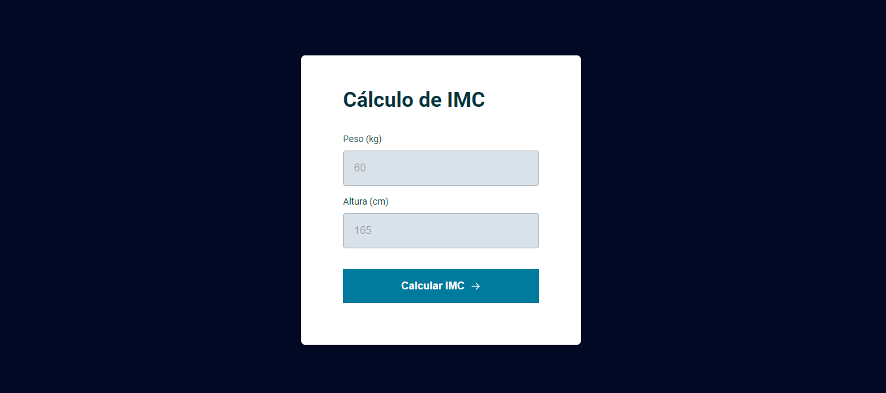

<h1 align="center"> Calculate IMC </h1>

Projeto feito com intuito de ajudar pessoas a calcarem o seu IMC e terem uma vida mais saudável.  

  <a href="#-tecnologias">Tecnologias</a>&nbsp;&nbsp;&nbsp;|&nbsp;&nbsp;&nbsp;
  <a href="#-projeto">Projeto</a>&nbsp;&nbsp;&nbsp;|&nbsp;&nbsp;&nbsp;
  <a href="#memo-licença">Licença</a>

 

  

## 🚀 Tecnologias

Esse projeto foi desenvolvido com as seguintes tecnologias:

- HTML e CSS - JAVA SCRIPT
- Git e Github
- Figma: https://www.figma.com/file/ZESCAIE9GOnkSnFyGIOBD4/IMC-Copy?fuid=1180886675785091585

## 💻 Projeto

O projeto foi um estudo do curso Rocket Seat visando ensinar alguns conceitos e tecnologias.

Você pode acessar o app do projeto através do link - [Visite o projeto online](https://ramirisonoliveira.github.io/CalculateIMC)

## ROL: Licença

Esse projeto está sob a licença ROL.

---

Feito by Ramirison Oliveira(https://github.com/RamirisonOliveira)